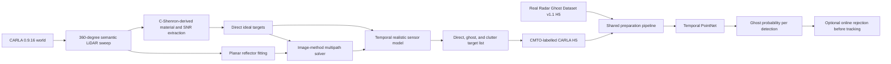

# CARLA FMCW-Like Radar and Multipath False-Alarm Detection

## Implementation, Data, Experiments, Results, and Research Status

**Repository:** `End-to-End-Autonomous-Driving-with-Sensor-Fusion`  
**Primary implementation:** `carla4/`  
**Target CARLA version:** 0.9.16  
**Report date:** 4 August 2026  
**Current research task:** classify each automotive-radar detection as a direct
return (`real`) or a multipath return (`ghost`). Driving-policy evaluation is
not the present objective.

## 1. Executive Summary

CARLA's standard radar is a fast ray-cast sensor. It returns depth, azimuth,
altitude, and relative velocity, but it does not model material-dependent RF
response, deterministic multipath propagation, target-level detection
probability, temporally correlated measurement errors, interference, radar
clutter, processing latency, or target tracking.

This repository therefore implements a **native CARLA 0.9.16, FMCW-like
target-list simulator**. It is assembled as follows:

1. CARLA semantic LiDAR supplies visible geometry, incidence cosine, semantic
   class, and object identity.
2. A C-Shenron-derived surface model maps CARLA semantic classes to broad RF
   material classes and estimates ideal received power/SNR.
3. A custom planar reflector fitter detects walls, buildings, fences, static
   structures, bridges, and guardrails.
4. A custom mirror/image-method solver creates type-1 second-order, type-2
   second-order, and type-2 third-order multipath paths.
5. A custom temporal sensor model applies detection probability, misses,
   correlated range/angle/Doppler error, quantization, weather attenuation,
   clutter, interference, latency, and tracking.
6. CARLA truth and path metadata create compatible Radar Ghost Dataset CMTO
   labels. These fields are supervision only; they are not classifier inputs.
7. A lightweight Temporal PointNet classifies each current detection using its
   physical features and spatial/temporal point-set context.

The implementation is **not a full raw-FMCW simulator**. It does not synthesize
chirps, ADC samples, antenna-array phase, range/Doppler/angle FFTs, CFAR,
micro-Doppler, polarization, or radome effects. “FMCW-like” means that the
target list has FMCW-relevant range, azimuth, Doppler, amplitude/SNR,
resolution, ambiguity, latency, and multipath behavior.

The current CARLA-only model performs well on one held-out CARLA sequence
(AUPRC 0.9695), but its direct zero-shot evaluation on real radar data failed
(AUROC 0.5 and ghost recall 0). Therefore, the work currently demonstrates a
useful CARLA multipath generator and an in-domain detector, **not a validated
real-world detector and not proof that CARLA pretraining helps real data**.

## 2. Research Question and Terminology

The exact binary problem is:

> Given only radar-observable point-list features and recent point-list
> context, decide whether a current detection is a direct reflection from a
> real object or a multipath ghost.

In this project:

- `real` means an annotated direct return from a road user;
- `ghost` means a geometrically generated or manually annotated multipath
  return;
- `clutter` means an unstructured stochastic false alarm generated by the
  sensor model;
- `background` means a point without a clean direct/ghost annotation;
- detector `false positive` means a real return incorrectly rejected as a
  ghost;
- detector `false negative` means a ghost that the detector failed to reject.

Stochastic clutter is deliberately not trained as a clean multipath negative
or positive. The released real labels supervise direct-versus-multipath, not
every possible radar false-alarm mechanism.

## 3. End-to-End System Flow



The spectator camera used during collection is only for visual verification.
Camera pixels are not used by the implemented radar or classifier.

## 4. CARLA Default Radar Versus the Implemented Radar

CARLA 0.9.16 documents `sensor.other.radar` as a ray-cast conic sensor that
returns an array of `(velocity, azimuth, altitude, depth)` detections. Its
official blueprint defaults are 100 m range, 30 degrees horizontal FOV,
30 degrees vertical FOV, and 1,500 points/s. The older repository-native
adapter narrows this to 10 degrees horizontal, 2 degrees vertical, and
3,000 points/s for longitudinal control.

| Capability | CARLA standard radar | Repository `realistic` radar |
|---|---|---|
| CARLA actor | `sensor.other.radar` | `sensor.lidar.ray_cast_semantic` plus client-side radar physics |
| Basic geometry | Random ray hits | Dense semantic surface returns grouped into targets and reflectors |
| Output physics | Depth, angles, relative velocity | Range, azimuth, Doppler, SNR/amplitude, source and track state |
| Material response | No material-dependent radar response | Wood/concrete/human/metal mapping and incidence-dependent return power |
| Dynamic object identity | Not included in each public radar detection | CARLA actor ID used to construct latent truth and radial motion |
| Static geometry handling | Independent ray hits | Stable range/angle/tag cells; long meshes are not collapsed into one target |
| Multipath | Not modelled | Deterministic type-1/type-2 second- and type-2 third-order paths |
| Noise and misses | No configurable automotive target-list error model | SNR-conditioned misses and correlated range/azimuth/Doppler errors |
| Resolution | Ray output | 0.15 m range, 0.0278 m/s Doppler, 0.5-2 degree azimuth quantization |
| Doppler ambiguity | Not exposed as a radar parameter | Wrapped at +/-70 m/s |
| Clutter/interference | Not explicitly modelled | Poisson clutter and persistent interference bursts |
| Weather | No RF weather response | Explicit rain/fog/dust attenuation priors |
| Latency/tracking | No target-list tracker | One-scan delay, gated association, M-of-N confirmation, deletion and filtering |
| Semantic classes | Not returned | CARLA 0.9.16 classes used internally for physics and supervision |
| Perfect labels | No | Direct/ghost path truth available only during synthetic data generation |
| Raw FMCW ADC | No | No; this implementation remains target-list level |

The comparison should not be interpreted as “all custom parameters are
calibrated.” Several are visible research priors and must be fitted against a
specific physical radar before making a sensor-equivalence claim.

## 5. Exact Radar Setup Used for the CARLA Dataset

### 5.1 Placement and sampling

| Setting | Value used |
|---|---:|
| Parent | Ego vehicle |
| Mounting location | `x=2.5 m`, `y=0 m`, `z=1.0 m` in vehicle coordinates |
| Mounting rotation | No additional rotation for the realistic backend |
| Modelled carrier | 77 GHz |
| Maximum target range | 100 m |
| Radar horizontal FOV | 120 degrees (`+/-60` degrees) |
| Radar elevation FOV | `-8` to `+8` degrees |
| Radar cycle | 0.05 s / 20 Hz |
| Geometry sensor | CARLA semantic LiDAR |
| Semantic LiDAR channels | 32 |
| Semantic LiDAR points/s | 240,000 |
| Semantic LiDAR horizontal sweep | 360 degrees per callback |
| Semantic LiDAR rotation frequency | 20 Hz |
| Semantic LiDAR tick | 0.05 s |

The geometry sensor uses a full 360-degree sweep so a rotating partial sector
does not look like radar dropout. The radar core then applies the 120-degree
front FOV. This dense semantic LiDAR, rather than neural-network inference, is
the main extra GPU/scene-processing cost during collection.

### 5.2 Sensor envelope and errors

| Setting | Value |
|---|---:|
| Range resolution | 0.15 m |
| Doppler resolution | 0.1 km/h = 0.02778 m/s |
| Azimuth resolution | 0.5 degrees at boresight, degrading to 2 degrees at the edge |
| Maximum unambiguous Doppler | 70 m/s |
| Range error sigma | `0.06 + 0.45/sqrt(SNR_linear)` m |
| Doppler error sigma | `0.04 + 0.30/sqrt(SNR_linear)` m/s |
| Azimuth error sigma | `0.20 + 1.50/sqrt(SNR_linear)` degrees |
| Temporal error correlation | 0.82 |
| SNR fluctuation sigma | 1.5 dB |
| Detection midpoint and slope | 8 dB, logistic slope 0.55 |
| Detection probability bounds | 0.02 to 0.995 |
| Dropout entry/exit probability | 0.012 / 0.35 per scan |
| Detection scale while dropped out | 0.08 |
| Random clutter rate | 0.08 detections/scan before interference scaling |
| Stationary fraction of clutter | 0.75 |
| Interference entry/exit probability | 0.002 / 0.30 per scan |
| Interference detection scale | 0.25 |
| Interference clutter multiplier | 8 |
| Rain attenuation prior | 1.0 dB/100 m at normalized maximum |
| Fog attenuation prior | 0.05 dB/100 m at normalized maximum |
| Dust attenuation prior | 0.50 dB/100 m at normalized maximum |

The current `geometry_multipath_v1` profile disables the older probabilistic
ghost generator (`ghost_start_probability=0`, `ghost_survival_probability=0`,
`max_active_ghosts=0`). Therefore, labelled ghosts in this profile come from
accepted geometry paths, not arbitrary random range offsets.

### 5.3 Reflector and multipath settings

| Setting | Value |
|---|---:|
| Accepted reflector tags | Building 3, Wall 4, Fence 5, Static 20, Bridge 26, GuardRail 28 |
| Dynamic source tags | Pedestrian 12, Rider 13, Car 14, Truck 15, Bus 16, Train 17, Motorcycle 18, Bicycle 19, Dynamic 21 |
| Reflector grid-cell size | 8 m |
| Minimum points per reflector | 8 |
| Minimum fitted segment length | 1.5 m |
| Maximum planar RMS residual | 0.45 m |
| Fitted height range | -1.5 to +3.0 m |
| Maximum reflectors per scan | 48 |
| Maximum target-to-surface distance | 18 m |
| Minimum ghost/direct range separation | 0.30 m |
| Second-order bounce loss | 5 dB plus material reflection loss |
| Third-order bounce loss | 9 dB plus twice material reflection loss |
| Maximum ghosts per target | 6 |

Material reflection-loss priors are 1 dB for guardrails, 1.5 dB for metal
fences, 3 dB for walls, 3.5 dB for bridges, 4 dB for buildings, and 4.5 dB
for generic static objects.

### 5.4 Tracking and output

The model delays detections by one scan, predicts tracks between scans, and
associates by gates of 3 m range, 4 degrees azimuth, and 3 m/s Doppler. A track
is confirmed after two hits in a three-scan window and deleted after four
misses. Range, angle, and Doppler filter gains are 0.65, 0.55, and 0.60.

For compatibility with the existing driving code, the backend still exposes:

```python
{
    "distance": float,
    "relative_velocity": float,  # positive means closing
    "obstacle_speed": float,
}
```

The ghost-research H5 files retain the full per-detection target list before
that scalar reduction.

## 6. Where Each Component Came From

| Component | Source or motivation | What was actually used here |
|---|---|---|
| CARLA scene geometry and occlusion | CARLA 0.9.16 semantic LiDAR | Native sensor output: XYZ, incidence cosine, object ID, and semantic tag |
| CARLA semantic table | CARLA 0.9.16 sensor documentation | Correct post-0.9.14 IDs 0-28; older offset tables were not reused |
| RF material classes | C-Shenron/Shenron | Semantic classes mapped to unlabelled, wood, concrete, human, or metal |
| Surface return strength | C-Shenron `Sceneset.get_loss_3` design | Adapted roughness/permittivity, incidence, scatter/specular fractions, range loss, and 77 GHz wavelength dependence |
| Dynamic radial motion | C-Shenron integration concept plus CARLA kinematics | Relative actor/ego velocity projected onto the sensor-to-target line |
| Direct target clustering | Original repository implementation | Dynamic points grouped by actor; static meshes divided into stable range-angle-tag cells |
| Reflector extraction | Original repository implementation | Local 2-D PCA line fitting on semantic surface points |
| Multipath taxonomy | Radar Ghost Dataset paper | Type-1/type-2 and second/third-order path definitions |
| Multipath path construction | Original repository implementation using the standard image/mirror method | Specular-point validation, mirrored range/angle/Doppler, material and bounce loss |
| Need for material, multipath, wide-beam and noise physics | RadaRays paper | Design motivation and comparison baseline only; no RadaRays/Gazebo code is linked or copied |
| Target-list resolutions | Public RadarScenes sensor setup where applicable | 100 m, roughly +/-60 degrees, 0.15 m range and 0.1 km/h Doppler figures |
| Misses, correlated error, clutter, interference, weather, latency and tracker | Original repository phenomenological model | Explicit versioned priors in `RealisticRadarConfig`; not claimed as fitted RadarScenes parameters |
| Real labels and H5 schema | Radar Ghost Dataset v1.1 | CMTO label decoding and shared range/azimuth/Doppler/amplitude fields |
| Classifier family | PointNet idea and the Radar Ghost Dataset paper's temporal point-cloud experiments | Custom lightweight point encoder plus max-pooled temporal point-set context |
| CARLA collection scenarios, event enrichment, retry/resume | Original repository implementation | Normal Traffic Manager driving plus controlled reflector-crossing positive events |
| Online filter | Original repository implementation | Loads a checkpoint, reproduces training features, assigns ghost probability, rejects above threshold |

### 6.1 C-Shenron: used, but not copied in full

C-Shenron was selected because it is CARLA-specific and addresses the same
weakness in CARLA's native radar. The official framework combines scene
geometry, semantics, material-dependent scattering, and relative velocity to
produce high-fidelity range-angle/Doppler radar data.

This repository keeps its useful **material/scattering abstraction** but stops
before raw ADC or range-angle image synthesis. It also uses CARLA 0.9.16's
current semantic IDs rather than an older conversion table. Consequently,
this radar should be described as “C-Shenron-derived at target-list level,”
not as the exact upstream C-Shenron radar.

### 6.2 RadaRays: motivation, not an integrated dependency

RadaRays performs multi-bounce reflection, refraction, absorption, material
response, beam sampling, noise, and polar-image generation using Embree or
RTX/OptiX ray tracing. Its public integration targets rotating FMCW radar in
Gazebo/ROS mobile robotics.

No RadaRays source is part of this implementation. Requiring Gazebo, ROS,
mesh material authoring, and an additional ray-tracing runtime would conflict
with the goal of a Python-side CARLA 0.9.16 sensor. The ideas retained are that
radar simulation needs material response, reflection paths, noise, and a
clearly stated abstraction boundary.

### 6.3 What is original to this repository

The following are custom: CARLA 0.9.16 semantic compatibility, static-surface
cell grouping, planar reflector fitting, the deterministic path generator,
path-level truth propagation, the temporal target-list error model, CMTO H5
export, diverse CARLA collector, sequence-worker isolation, shared
real/synthetic feature preparation, Temporal PointNet, evaluation metrics,
and online ghost filtering.

## 7. How Direct and Ghost Points Are Labelled in CARLA

CARLA does not provide a native `real/ghost` field because its radar does not
simulate multipath. Labels are therefore generated by provenance:

1. A dynamic ideal target extracted directly from semantic geometry is a
   direct return.
2. A planar reflector must be observed in the current semantic-LiDAR scan.
3. The image-method solver must find a valid specular point on the fitted
   segment and pass same-side, incidence, segment-boundary, FOV, range, and
   target-to-surface checks.
4. The resulting path keeps the parent actor, reflector, bounce type, bounce
   order, path length, range, angle, Doppler, and SNR.
5. The realistic detection model may still miss the path according to its SNR.
6. Only an observable generated direct or ghost detection is written as a
   clean binary label.

The exporter follows the real dataset's CMTO convention:

- class: pedestrian 1, cyclist 2, car 3, large vehicle 4, motorcycle 5;
- direct return: bounce order 1, binary target 0;
- multipath return: binary target 1;
- physical third-order type-2 is encoded using the real dataset's order code
  4;
- unstructured clutter: label `-2` (noise/ignored for multipath training);
- static/unannotated context: label `0` (background/ignored);
- binary targets are `0=real`, `1=ghost`, `-1=ignore` after preparation.

CARLA uses `x-forward, y-right`; the real dataset uses `x-forward, y-left`.
The exporter negates CARLA azimuth and relative-velocity signs to match the
real H5 convention. The online runtime performs the inverse-compatible
conversion before inference.

## 8. CARLA Data Collection

### 8.1 Controlled collector

`carla4/collect_carla_radar_ghosts.py` is a validation/smoke collector. It
places a controlled vehicle beside a reflector discovered in the live
semantic scan, moves it along that surface, and refuses to write synthetic
ghost supervision unless the production path solver sees paths from that
actual CARLA actor. The target and chase spectator views were added to verify
placement visually.

This collector demonstrated that the geometry solver can generate the three
expected families. A successful 400-frame test reported six ideal multipath
paths per frame, 2,400 total ideal paths, 93 observable real points, and 180
observable ghost points near a guardrail.

It is not the main research dataset because its ego vehicle is deliberately
stationary and its controlled geometry is narrow.

### 8.2 Diverse driving collector

`carla4/collect_carla_radar_dataset.py` is the main synthetic collector. The
ego and ordinary NPCs use CARLA Traffic Manager; pedestrians use CARLA walker
controllers. A separate event vehicle is temporarily moved through a
validated reflector zone to prevent the naturally rare positive class from
being absent.

| Preset | Vehicle scale | Walker scale | Ego target speed | Purpose |
|---|---:|---:|---:|---|
| `urban_dense` | 1.30 | 1.20 | 30 km/h | Congested urban traffic |
| `highway_flow` | 1.50 | 0.20 | 65 km/h | Faster, vehicle-heavy flow |
| `pedestrian_dense` | 0.70 | 2.00 | 25 km/h | Higher VRU presence |
| `mixed_weather` | 1.00 | 1.00 | 40 km/h | Balanced traffic and weather rotation |

The collector rotates Town03/Town04 and clear, cloudy, wet, mid-rain, and
soft-rain-sunset weather. Each sequence runs in a fresh Python worker to avoid
CARLA native callback state surviving a world transition. A failed worker is
retried once, completed H5/summary pairs can be skipped with `--resume`, and
actors are destroyed synchronously.

### 8.3 H5 content

Each CARLA H5 `radar` row contains:

`frame`, `frame_timestamp`, `timestamp`, `sensor`, `x_cc`, `y_cc`, `r_sc`,
`phi_sc`, `vr_sc`, `amp`, `uuid`, `label_id`, `instance_id`, `source`,
`parent_object_id`, `reflector_id`, `bounce_type`, `bounce_order`, and
`path_length_m`.

The file attributes record town, scene, weather, seed, collection arguments,
radar configuration signature, positive-event plans, and event failures.

## 9. Datasets Used and Why

### 9.1 Synthetic CARLA dataset

The synthetic dataset is required because it offers:

- exact direct/ghost provenance without manual annotation;
- known reflector and parent object;
- selectable weather, traffic, town, geometry, and seed;
- dense positive enrichment for rare multipath paths;
- native online use in arbitrary CARLA scenes.

It is not sufficient by itself because its amplitudes, target classes, event
motion, temporal rate, scene materials, and detection statistics are not yet
calibrated to the physical radar used by the real dataset.

### 9.2 Radar Ghost Dataset v1.1

The real dataset is the **Radar Ghost Dataset v1.1**, obtained from the fixed
Zenodo record:

- DOI: <https://doi.org/10.5281/zenodo.6676246>
- official repository: <https://github.com/flkraus/ghosts>
- license reported by the download utility: CC BY-NC-SA 4.0
- local download script: `carla4/download_radar_ghost_dataset.py`
- extracted input: `carla4/data/radar_ghost_v1_1/original`

Version 1.1 is used because it fixes the radar/LiDAR synchronization issue in
version 1.0 and adds consistent car/sensor coordinate fields. The downloader
supports HTTP resume, verifies the exact 5,818,814,597-byte archive and MD5,
checks disk space, rejects unsafe ZIP paths, and extracts without committing
the dataset to Git.

The official paper reports:

- 111 manually annotated original sequences from 21 scenarios;
- approximately 71 minutes of data;
- 10 Hz frames with two experimental radars mounted in the front bumper;
- roughly 35 million radar points and about one million annotations;
- approximately 100,000 ghost and 600,000 real annotated points;
- a mainly stationary ego vehicle and a pedestrian/cyclist moving near walls,
  facades, parked vehicles, curbstones, metal doors, or guardrails;
- detailed type-1/type-2 and second/third-order annotations;
- official 75/8/28 sequence train/validation/test splits, with test scenarios
  separated from training scenarios.

This dataset was chosen over a generic automotive radar dataset because the
research question needs **explicit multipath path labels**, not merely object
boxes or moving-object classes. The paper also motivates temporal point-cloud
processing: its best semantic-segmentation input used amplitude, Doppler, and
relative time accumulated over three sensor cycles.

### 9.3 Why both datasets are necessary

CARLA answers “what path generated this detection?” under controlled geometry.
The real dataset answers “does a detector work on an actual radar and actual
multipath?” A defensible workflow must use CARLA for controlled synthetic
supervision and ablation, then use real train/validation data for adaptation
and untouched real test data for the final claim.

## 10. Shared Data Preparation

`carla4/prepare_radar_ghost_dataset.py` accepts both official H5 files and
compatible CARLA H5 files. It:

1. reads range, azimuth, radial velocity, amplitude, frame/time, sensor, and
   label fields;
2. decodes CMTO labels;
3. removes non-finite/invalid-range points;
4. preserves optional coordinate, instance, and group metadata;
5. writes compressed sequence NPZ files;
6. writes `manifest.json` with provenance, feature schema, sensor mapping,
   splits, and class counts.

Three split modes exist:

- `official`: preserves real dataset train/val/test directories;
- `scenario_grouped`: deterministic 70/15/15 grouping without sharing a
  scenario ID across splits;
- `all_train`: only for special-purpose preparation.

Background, ignore, noise, and sketchy labels are not used as clean direct
returns by default. This avoids converting “not annotated” into “definitely
real.”

## 11. Classifier Model

### 11.1 Input features

The detector is intentionally denied CARLA-only truth fields. For each point
it receives eight physical features:

| Feature | Transformation |
|---|---|
| Sensor X | `range*cos(azimuth)/100` |
| Sensor Y | `range*sin(azimuth)/100` |
| Range | `range/100` |
| Azimuth sine | `sin(azimuth)` |
| Azimuth cosine | `cos(azimuth)` |
| Radial velocity | `velocity/40` |
| Echo amplitude | `sign(amp)*log(1+abs(amp))/10` |
| Point age | clipped `age/0.5` |

CARLA SNR is converted to a positive amplitude proxy using
`10^(SNR_dB/20)`. This proxy has not yet been calibrated to the hardware
amplitude field and is a leading suspected source of the sim-to-real gap.

### 11.2 Temporal PointNet architecture

The selected model is `temporal_pointnet`, a custom lightweight PointNet-like
binary classifier:

1. each 8-D point is encoded by `8 -> 128 -> 192` with ReLU;
2. masked max pooling produces one 192-D context vector for the complete
   multi-frame point set;
3. each local 192-D vector is concatenated with that global context;
4. the head uses `384 -> 192 -> 128 -> 1`, ReLU, and dropout;
5. sigmoid converts the final logit to ghost probability.

The training configuration uses five frames and at most 1,024 points. Current
frame points are retained first; older context is subsampled if capacity is
exceeded. Only current-frame clean labels contribute to the loss.

### 11.3 Why this model was chosen

- The input is an unordered target list, making permutation-invariant point
  encoding more natural than a regular image CNN.
- Multipath is contextual: a ghost's relation to a direct target, reflector,
  and previous scans is more informative than an isolated point.
- It is small enough for training and online inference on an RTX 3060.
- It uses the same point features for real and CARLA data.
- It follows the real dataset paper's finding that temporal accumulation,
  amplitude, and Doppler matter.

It is not the paper's full PointNet++/SGPN model and does not perform instance
segmentation. `point_mlp` remains available as an independent-point ablation.

### 11.4 Training procedure

The completed CARLA training used:

| Setting | Value |
|---|---:|
| Model | Temporal PointNet |
| Frames | 5 |
| Maximum points | 1,024 |
| Hidden/context dimensions | 128 / 192 |
| Dropout | 0.15 |
| Epochs | 50 |
| Batch size | 16 |
| Optimizer | AdamW |
| Learning rate | 0.001 |
| Weight decay | 0.0001 |
| Loss | `BCEWithLogitsLoss` |
| Positive weight | `real_count/ghost_count`, clipped to 0.1-20 |
| Gradient clipping | Norm 5 |
| Scheduler | Reduce-on-plateau by 0.5 after 6 epochs |
| Target deployment constraint | Maximum validation real-rejection rate 1% |
| Checkpoint selection | Highest validation AUPRC |

Training augmentation randomly mirrors azimuth, applies a small log-normal
amplitude multiplier, and adds 0.03 m/s Doppler noise.

### 11.5 Runtime use

`RuntimeGhostFilter` checks checkpoint feature schema/order, keeps the required
history, builds the same features, and assigns a ghost probability to current
detections. Non-clutter detections above the checkpoint threshold are removed
before sensor latency/tracking. Random clutter is retained because it is
outside the real multipath label definition.

## 12. Work Completed and Problems Fixed

1. Added a C-Shenron-derived material-aware radar backend while preserving the
   original `distance/relative_velocity/obstacle_speed` contract.
2. Corrected semantic IDs for CARLA 0.9.16, including pedestrian 12, car 14,
   static 20, dynamic 21, bridge 26, and guardrail 28.
3. Added temporal sensor imperfections, weather priors, clutter,
   interference, quantization, latency, tracking, and configuration hashes.
4. Replaced arbitrary probabilistic ghosts in the research profile with
   deterministic geometry-derived paths.
5. Added the real dataset downloader with resume, checksum, size, disk, and
   safe-extraction checks.
6. Added CMTO labels, shared feature preparation, Temporal PointNet training,
   per-scenario/per-bounce evaluation, and online rejection.
7. Fixed the initial `ghost=0` issue by adding an actual controlled CARLA
   target beside a live reflector and validating that actor's paths.
8. Added target and chase spectator views for visual verification.
9. Replaced the stationary smoke setup as the main collector with normal ego,
   NPC, and pedestrian traffic across multiple presets, towns, and weather.
10. Added per-frame callback waiting with diagnostics after radar callbacks
    initially timed out one frame behind.
11. Isolated each sequence in a new Python worker and added retry/resume after
    CARLA segfaulted during a Town03-to-Town04 world transition.
12. Prepared CARLA and real data through the same physical feature contract.

## 13. Actual CARLA Pilot Dataset

The completed pilot contains eight 60-second sequences. The original command
was intended to request 30 seconds and a nested output directory, but a shell
line break executed the first line alone. The actual output therefore used
the defaults: 60 seconds, 1,200 frames/sequence, and `artifacts/train`. These
facts are inferred directly from the recorded output and should be preserved
in experiment metadata.

| # | Scene | Town | Weather | Points | Real | Ghost | Frames with multipath |
|---:|---|---|---|---:|---:|---:|---:|
| 0 | urban_dense | Town03 | clear_noon | 249,490 | 3,226 | 4,950 | 1,001 |
| 1 | urban_dense | Town04 | cloudy_noon | 161,663 | 1,759 | 5,045 | 966 |
| 2 | highway_flow | Town03 | mid_rain_noon | 243,758 | 4,738 | 267 | 445 |
| 3 | highway_flow | Town04 | soft_rain_sunset | 152,438 | 1,028 | 4,228 | 805 |
| 4 | pedestrian_dense | Town03 | cloudy_noon | 196,500 | 1,829 | 1,268 | 876 |
| 5 | pedestrian_dense | Town04 | wet_noon | 304,812 | 2,091 | 8,531 | 1,200 |
| 6 | mixed_weather | Town03 | soft_rain_sunset | 280,836 | 3,357 | 2,059 | 861 |
| 7 | mixed_weather | Town04 | clear_noon | 162,801 | 1,395 | 4,858 | 931 |
| **Total** |  |  |  | **1,752,298** | **19,423** | **31,206** | **7,085/9,600** |

All eight workers completed and all 40 controlled events reported no path
validation failure. The prepared `scenario_grouped` split is:

- train: six sequences;
- validation: pedestrian-dense Town03;
- test: urban-dense Town04.

This is adequate for a pipeline pilot, but the single validation and single
test sequences make uncertainty high and do not support a broad CARLA
generalization claim.

## 14. Completed Model Results

### 14.1 CARLA training

Training was performed on an NVIDIA RTX 3060 and completed in less than one
hour according to the recorded run. Training loss decreased from 0.355 at
epoch 1 to 0.024 at epoch 50. The best logged validation AUPRC was 0.9494 at
epoch 20; later training loss continued decreasing while validation loss
generally increased, showing overfitting. The script retained the checkpoint
with highest validation AUPRC rather than the final epoch.

Checkpoint:

`artifacts/ghost_carla_model/best_detector.pt`

### 14.2 Held-out CARLA test

| Metric | Result |
|---|---:|
| AUPRC | 0.9695 |
| AUROC | 0.9367 |
| Best F1 over test thresholds | 0.9414 |
| Stored validation threshold | 0.996 |
| Precision at stored threshold | 0.9813 |
| Ghost recall at stored threshold | 0.6755 |
| Real false-positive/rejection rate | 0.0370 |
| True positive / false negative | 3,408 / 1,637 |
| True negative / false positive | 1,694 / 65 |

Recall by path at the stored threshold:

- type-1 second-order: 0.5355;
- type-2 second-order: 0.7516;
- type-2 third-order: 0.9145.

The result shows strong in-domain ranking but misses roughly one third of
ghosts and exceeds the intended 1% real-rejection limit on the test sequence.
The best-F1 threshold was calculated from test labels and must not be treated
as a deployment threshold.

### 14.3 Zero-shot real-data test

The CARLA checkpoint was evaluated directly on the untouched official real
test split before any real fine-tuning:

| Metric | Result |
|---|---:|
| Real points | 167,574 |
| Ghost points | 22,398 |
| AUPRC | 0.1179 |
| AUROC | 0.5000 |
| Ghost recall at stored threshold | 0.0000 |
| Real false-positive/rejection rate | 0.0000 |
| True positive / false negative | 0 / 22,398 |

The model assigned no usable positive score and predicted every labelled real
dataset point as direct. Zero false positives here are not a success because
recall is zero. This is a complete synthetic-to-real zero-shot failure.

Likely causes, still requiring measured feature-distribution diagnostics, are:

- CARLA positive events are dominated by a controlled vehicle, while the real
  dataset mainly contains pedestrian/cyclist ghosts;
- CARLA is 20 Hz while the physical dataset is 10 Hz, so five frames cover
  different time durations;
- the CARLA amplitude is derived from simulated SNR and is not calibrated to
  physical `amp` values;
- the sensors have different mounting/FOV and point-density distributions;
- the CARLA pilot has only eight highly correlated sequences;
- controlled positive enrichment changes class prevalence and geometry.

## 15. Compute and Time Record

| Task | Hardware/status | Time or size |
|---|---|---|
| Real dataset download | Remote system | 5.4 GiB archive; resumable; completed |
| Real dataset extraction | Remote system | 115 ZIP entries, about 13.9 GiB extracted |
| CARLA pilot collection | CARLA plus semantic LiDAR | Exact wall time not recorded; observed to be substantially slower than ordinary CARLA runs |
| CARLA model training | RTX 3060, 50 epochs, batch 16 | Less than 1 hour (reported) |
| CARLA evaluation | RTX 3060/automatic CUDA | Completed; exact wall time not recorded |
| Real zero-shot evaluation | RTX 3060/automatic CUDA | Completed; exact wall time not recorded |
| Proposed full real fine-tuning | Not run | Earlier estimate 2-5 hours; this is not a measurement |

Collection is slow because CARLA renders the scene, emits 240,000 semantic
LiDAR points/s, processes each sweep into targets and reflectors, solves
multipath paths, applies the sensor model, and compresses H5 output in
synchronous mode. Neural-network training is not occurring during collection.

## 16. Current Scientific Conclusion

What is supported:

- the custom radar is materially richer than CARLA's ray-cast radar;
- deterministic path-labelled multipath can be generated natively from CARLA
  0.9.16 geometry;
- the collector produces varied traffic, town, weather, reflector, and path
  examples;
- the classifier learns the current CARLA distribution;
- the shared H5 and feature pipeline can read official real data;
- the current synthetic-only detector does not transfer zero-shot to the real
  sensor.

What is not supported:

- that the radar exactly reproduces a particular physical FMCW radar;
- that the implementation is identical to full C-Shenron or RadaRays;
- that 0.9695 CARLA AUPRC represents real-world accuracy;
- that CARLA pretraining improves real performance;
- that the current checkpoint is safe to deploy;
- that full real-data fine-tuning alone would prove CARLA's usefulness.

## 17. Correct Next Research Plan

Do not immediately fine-tune for many epochs on all real training data and
then claim that CARLA helped. That experiment can overwrite the synthetic
initialization and hide whether it contributed.

### Phase A: diagnose and reduce the domain gap

1. Add a report of train/validation distributions for all eight physical
   features in CARLA and real data, separated by real/ghost and bounce type.
2. Calibrate or domain-normalize simulated amplitude against real `amp`.
3. Use a time-duration window rather than a fixed frame-count window, or
   resample CARLA to match the real 10 Hz cadence.
4. Add controlled pedestrian and cyclist multipath events in CARLA instead of
   relying mainly on a vehicle event target.
5. Compare class, range, azimuth, Doppler, amplitude, point-count, lifetime,
   and bounce-type distributions.

### Phase B: prove whether CARLA helps

For each real-data fraction (recommended 10%, 25%, and 100%), train with the
same split, seed, architecture, epochs, and stopping rule:

1. real-only model from random initialization;
2. CARLA-pretrained model fine-tuned on that real fraction;
3. optionally a mixed real/CARLA model with balanced domain batches.

Compare AUPRC, AUROC, F1, recall at no more than 1% real rejection, per-bounce
recall, per-class false rejection, calibration, and convergence speed. CARLA
has demonstrated value only if pretraining improves held-out real performance
or reaches the same performance with less labelled real data.

### Phase C: final dual-domain model

Select thresholds only on validation data. Evaluate once on the untouched
official real test split and separately on a larger, scenario-disjoint CARLA
test set. Re-evaluate the real-adapted model on CARLA to measure catastrophic
forgetting. Only then integrate the checkpoint into online CARLA rejection.

## 18. Reproducible Commands and Current Artifact Paths

Run commands from `carla4/`. Keep every continued line ending in `\`, or copy
the complete code block at once; earlier missing continuations silently
changed output paths and duration arguments.

### Download and prepare real data

```bash
python3 download_radar_ghost_dataset.py

python3 prepare_radar_ghost_dataset.py \
  --input data/radar_ghost_v1_1/original \
  --output artifacts/ghost_real_official \
  --split-mode official
```

### Collect a reproducible CARLA pilot

```bash
python3 collect_carla_radar_dataset.py \
  --towns Town03 Town04 \
  --output artifacts/carla_radar_pilot \
  --split train \
  --sequences 8 \
  --duration 60 \
  --vehicles 45 \
  --walkers 25 \
  --seed 100 \
  --radar-timeout 30 \
  --headless \
  --resume
```

### Prepare the completed pilot actually stored under `artifacts/train`

```bash
python3 prepare_radar_ghost_dataset.py \
  --input artifacts/train \
  --output artifacts/ghost_prepared \
  --split-mode scenario_grouped
```

### Train and evaluate the completed CARLA model

```bash
python3 train_radar_ghost_detector.py \
  --data artifacts/ghost_prepared \
  --output artifacts/ghost_carla_model \
  --model temporal_pointnet \
  --window-frames 5 \
  --max-points 1024 \
  --hidden-dim 128 \
  --context-dim 192 \
  --epochs 50 \
  --batch-size 16

python3 evaluate_radar_ghost_detector.py \
  --data artifacts/ghost_prepared \
  --checkpoint artifacts/ghost_carla_model/best_detector.pt \
  --split test \
  --output artifacts/ghost_carla_model/carla_test.json

python3 evaluate_radar_ghost_detector.py \
  --data artifacts/ghost_real_official \
  --checkpoint artifacts/ghost_carla_model/best_detector.pt \
  --split test \
  --output artifacts/ghost_carla_model/real_zero_shot.json
```

The proposed full real fine-tuning command exists in
`carla4/radar/GHOST_DETECTION.md`, but it is intentionally deferred until
limited-real-data baselines can be run fairly.

## 19. Important Source Files

| File | Responsibility |
|---|---|
| `carla4/radar/front_radar.py` | Native, C-Shenron-derived, and realistic CARLA sensor adapters |
| `carla4/radar/cshenron_core.py` | CARLA semantic decoding, material mapping, return power, direct target extraction |
| `carla4/radar/multipath.py` | Reflector fitting and deterministic image-method paths |
| `carla4/radar/realistic_core.py` | Sensor envelope, errors, misses, clutter, interference, latency, tracker and selector |
| `carla4/radar/profiles/geometry_multipath_v1.json` | Enables geometry paths and disables probabilistic ghosts |
| `carla4/collect_carla_radar_ghosts.py` | Controlled path-validation collector and common H5 label utilities |
| `carla4/collect_carla_radar_dataset.py` | Diverse driving collector with worker isolation/retry/resume |
| `carla4/download_radar_ghost_dataset.py` | Verified resumable real dataset download/extraction |
| `carla4/prepare_radar_ghost_dataset.py` | Shared real/CARLA H5 preparation and split manifest |
| `carla4/radar/ghost_detection/labels.py` | CMTO decoding and binary targets |
| `carla4/radar/ghost_detection/features.py` | Shared eight-feature physical contract |
| `carla4/radar/ghost_detection/dataset.py` | Multi-frame point-set loading and sampling |
| `carla4/radar/ghost_detection/model.py` | Point MLP and Temporal PointNet |
| `carla4/train_radar_ghost_detector.py` | Training, weighting, checkpoint and validation threshold |
| `carla4/evaluate_radar_ghost_detector.py` | Global, scenario, class and bounce metrics |
| `carla4/radar/ghost_detection/runtime.py` | Online checkpoint inference and rejection |
| `carla4/radar/GHOST_DETECTION.md` | Detailed operational runbook |

## 20. Primary References

1. [CARLA 0.9.16 sensor reference](https://carla.readthedocs.io/en/0.9.16/ref_sensors/)
2. [CARLA radar source/Doxygen](https://carla.org/Doxygen/html/d9/d27/classARadar.html)
3. [C-Shenron project page](https://ucsdwcsng.github.io/c-shenron/)
4. [Official C-Shenron repository](https://github.com/ucsdwcsng/c-shenron)
5. [C-Shenron paper: *A Realistic Radar Simulator for End-to-End Autonomous Driving in CARLA*](https://wcsng.ucsd.edu/files/c-shenron_paper.pdf)
6. [RadaRays paper](https://arxiv.org/abs/2310.03505)
7. [RadaRays repository and Gazebo plugin links](https://github.com/uos/radarays)
8. [Radar Ghost Dataset official repository](https://github.com/flkraus/ghosts)
9. [Radar Ghost Dataset v1.1 DOI](https://doi.org/10.5281/zenodo.6676246)
10. [Radar Ghost Dataset paper](https://arxiv.org/abs/2404.01437)
11. [PointNet paper](https://arxiv.org/abs/1612.00593)
12. [RadarScenes sensor setup](https://radar-scenes.com/dataset/sensors/)

